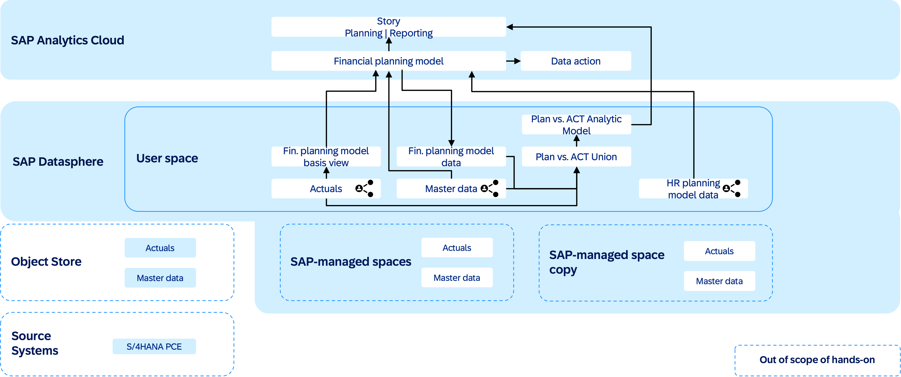

# DA267 - Seamless planning for xP&A in SAP Business Data Cloud (SAP BDC)

## Description

This repository contains the material for the SAP TechEd 2025 session called DA267 - Seamless planning for xP&A in SAP Business Data Cloud (SAP BDC).  

## Overview

This session introduces attendees to the seamless planning integration of SAP Analytics Cloud and SAP Datasphere in the context of SAP Business Data Cloud. Find the introduction slides shown on-site here: [PPT](images/DA267_Flow.pptx)

In this session, we will:
- Leverage a view shared from the content of the Working Capital Insights app to create a planning model with a live connection to the view's data
- Load master data from SAP Datasphere
- Expose the planning model data in SAP Datasphere and build a plan vs. actual reporting using an analytic model and time-dependent master data
- Extend the planning model with generic financial p&l planning dimensions and measures
- Integrate data from an HR planning model (shared with you) to derive personnel expenses

Along the way, we will create a story in SAP Analytics Cloud to plan and report. 

We will abstract away from some of the complexity that such a use case would normally bring, e.g.
- We will work in one planning model
- We will work with a small set of dimensions
- We will work with a simplified master data table w/o text tables, directories etc.
- We will ignore multi-currency
- We will use simplified, central planning assumptions

## Requirements

The requirements to follow the exercises in this repository are:
- Knowledge of planning in SAP Analytics Cloud
- Basic understanding of the concepts of SAP Datasphere

## Exercises

Get started [here](exercises/ex0_setup/README.md)

## Learn more
- [Seamless Planning release announcement]()
- [Seamless Planning Product FAQ]()
- [Seamless Planning live versions]()
- [SAP help on seamless planning]()
- [Learning journey on SAP BDC](https://learning.sap.com/courses/bt_bdc/bdc-intro)
- [SAP help on SAP Datasphere data builder](http://help.sap.com/docs/SAP_DATASPHERE/c8a54ee704e94e15926551293243fd1d/5c1e3d4a49554fcd8fcf199d664d1109.html)
- [Introducing the Analytic Model in SAP Datasphere](https://community.sap.com/t5/technology-blog-posts-by-sap/introducing-the-analytic-model-in-sap-datasphere/ba-p/13568591)
- [SAP help on the analytic model in SAP Datasphere](https://help.sap.com/docs/SAP_DATASPHERE/c8a54ee704e94e15926551293243fd1d/e5fbe9e2cb93484dab8b1963145e565f.html)

## Contributing
Please read the [CONTRIBUTING.md](./CONTRIBUTING.md) to understand the contribution guidelines.

## Code of Conduct
Please read the [SAP Open Source Code of Conduct](https://github.com/SAP-samples/.github/blob/main/CODE_OF_CONDUCT.md).

## How to obtain support

Support for the content in this repository is available during the actual time of the online session for which this content has been designed. Otherwise, you may request support via the [Issues](../../issues) tab.

## License
Copyright (c) 2025 SAP SE or an SAP affiliate company. All rights reserved. This project is licensed under the Apache Software License, version 2.0 except as noted otherwise in the [LICENSE](LICENSES/Apache-2.0.txt) file.

