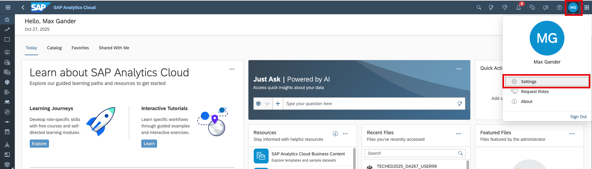
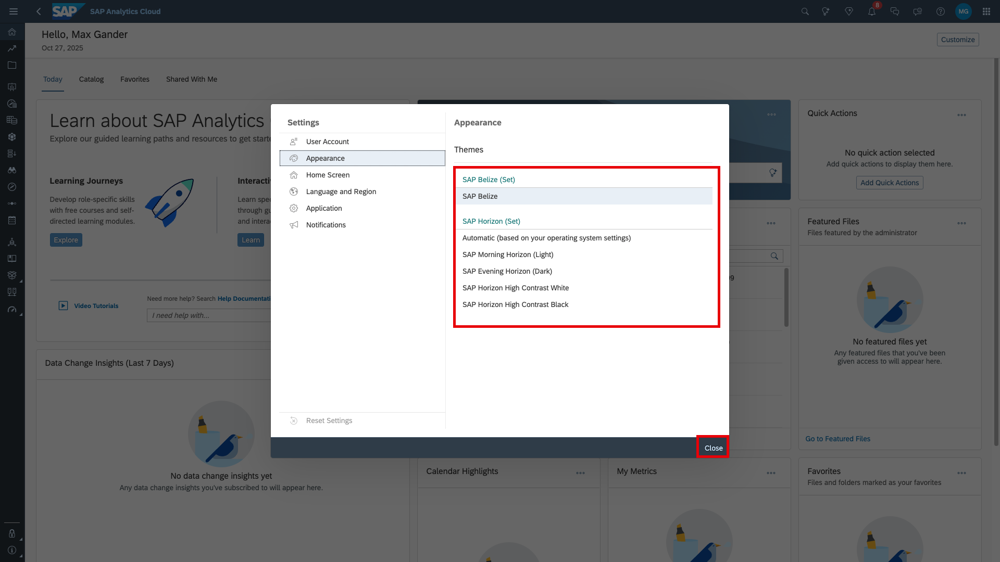

# Systems

## Links
- [SAP Analytics Cloud](https://trial-bdc-sac-3.eu10.sapanalytics.cloud/sap/fpa/ui/app.html#/home)
- [SAP Datasphere](https://trial-bdc-datasphere-3.eu10.hcs.cloud.sap/dwaas-core/index.html)

## SAP Datasphere 
### Space set-up
A space is available and assigned for each participant couple. The space name is DA267_USERxx (fill xx with your user number that you find on your PC; e.g., DA267_USER01). 

## SAP Analytics Cloud
### File repository
You are asked to work in 'My Files', so not in the 'Public' folder. 
You find some sample materials under 'Public/TechEd2025_DA267'. No need to check them now as they will be referred to in the exercises where they will be needed. 

### Theming
WIth the QRC4.2025 delivery of SAP Analytics Cloud, you can personalize the appearance of SAP Analytics Cloud. The screenshots for this exercise were taken in the *SAP Belize* theme. In the future, *SAP Morning Horizon (Light)* is foreseen as the default theme. 
Choose your favorite theme like this.

1. Navigate to your user. Go to *Settings*

2. Select your theme and close. 

> [!NOTE]  
> The selection of the SAP Analytics Cloud theme makes no difference from a functional perspective. Since all screenshots were taken in *SAP Belize*, it may be slightly easier to navigate based on the screenshots when using the same theme. Horizon themes offer a more modern UI as well as high-contrast options. 

Now, move on to the first real exercise. [Exercise 1 - Create planning model](../ex1_create_planning_model/ex1.1_create_DSP_view/README.md)

