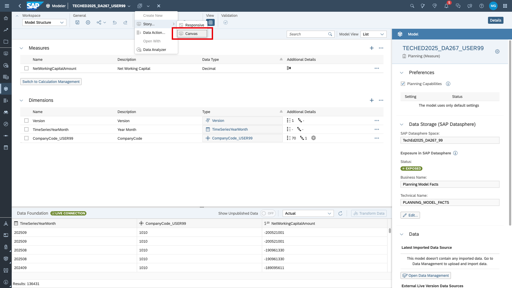
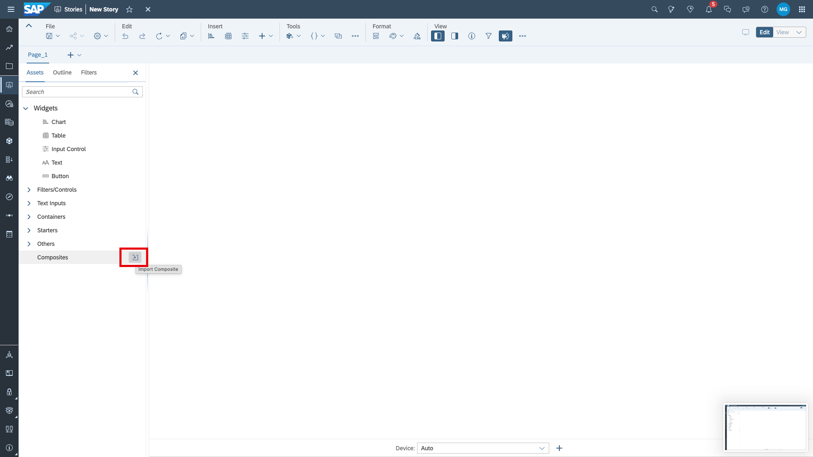
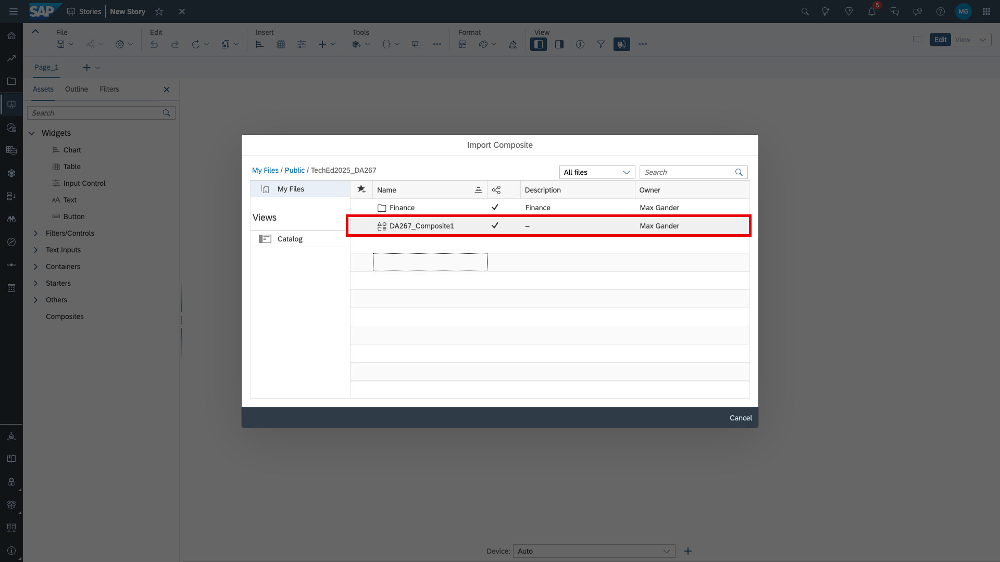
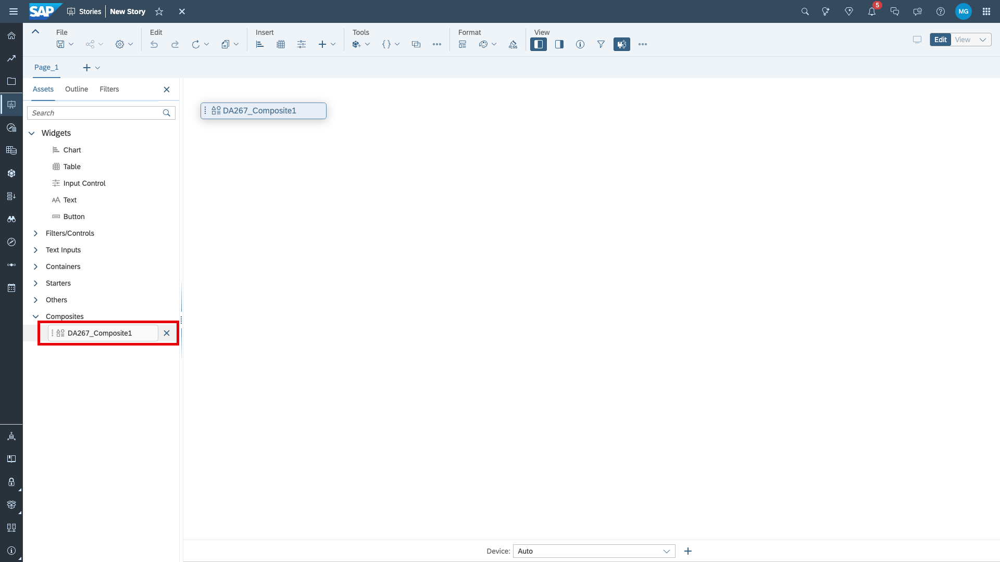
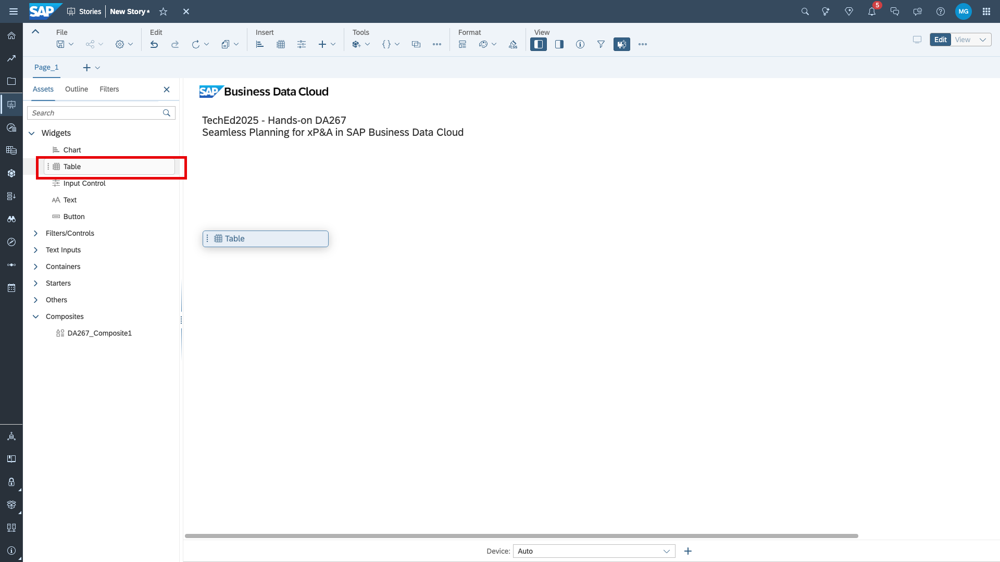
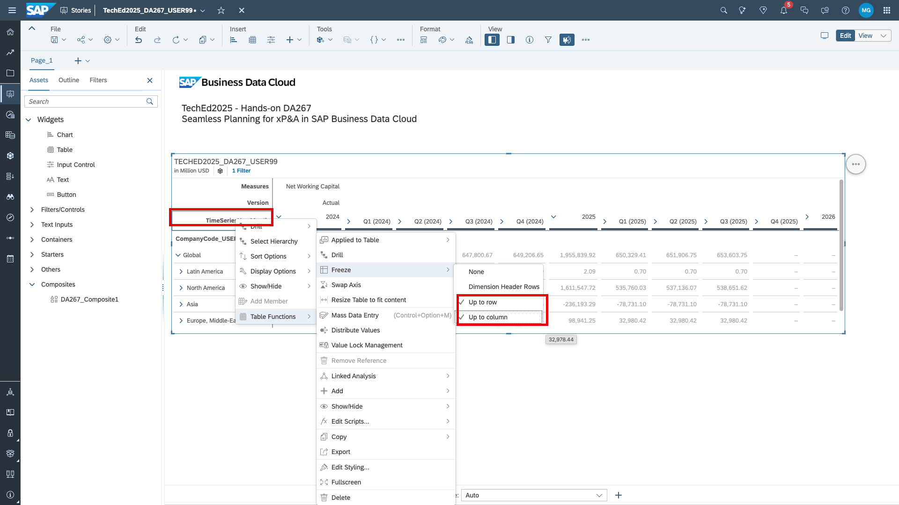

# Create planning story
In this exercise, you will build a story on the of the model that you created in [exercise 1](../ex1_create_planning_model). 

1. Create story. You can start directly from your model.

2. You can use a composite to re-use a predefined page header. Import it from the public TechEd DA267 folder.

3. Drag the composite to the top left corner of the canvas.

4. Add a table to the canvas by dragging it to the canvas. 

5. Configure the planning table as follows. Basic story building skills are assumed. Hence, no click-by-click guide is provided. Instead, refer to the gif. 
Rows: add company code
  Columns: add TimeSeriesYearMonth dimension
  Filter: 2024, 2025, 2026 on TimeSeriesYearMonth
  Unbooked on for TimeSeriesYearMonth and Version dimensions

6. Right-click on the marked cell and freeze panes.

7. Now create a blank planning version. Mark the table and go to version management.

8. Create blank version and give it a name and a category.

9. Now enter plan data for 2026. Drill-down the date hierarchy and you will see we have actual data up until Q3 in 2025. We copy this data to the year 2026 in the plan version. We fill Q4 2026 from the 2024 actuals. Now, you can change the data for 2026 (e.g., by adding a factor of +1%). Publish the version.

> [!NOTE]  
> Live version data is never editable. But you can refer it via copy/paste, in version management, data actions (incl. advanced formulas), story & model calculations.

> [!IMPORTANT]  
> Do not forget to publish!

Now we have added plan data to our model. We will no go ahead to [exercise 3 - create analytic model in SAP Datasphere](../ex3_analytic_model/ex3.1_union/README.md)
