# Bring plan and actual data together in SAP Datasphere in a union view
In this exercise, we will first build a union to combine plan and actual data. Then, we will build an analytic model on top of it [exercise 3.2](../ex3.2_analytic_model). 

> [!NOTE]  
> You may wonder why we again create a plan vs. actual comparison as we could also report on the planning model directly which also has the plan data and live actuals. There are many reasons why you will need an analytic model in real life. In this exercise, we simplified heavily. 
> - Use time-dependet master data, hierarchies, texts etc. (this what we do in this exercise)
> - Use the full granularity of actuals that you may not want to have in your planning model (performance!). Imagine loading the full ACDOCA table to a planning model... Does not sound right!
> - Use attributes etc. that are not part of your planning model
> - Data may be homogenous. SAP Datasphere will give you everything you need to align models
> - Share plan data in many analytic scenarios and across domains.

1. Go back to [SAP Datasphere](https://trial-bdc-datasphere-3.eu10.hcs.cloud.sap/dwaas-core/index.html), go to the data builder, select your space and create a new graphical view.

2. Pull the shared view `Net Working Capital Time Series Currency Role (HL)` to the canvas. Create a calculated column to assign a version to the actual data. We call it `public.Actual`. 
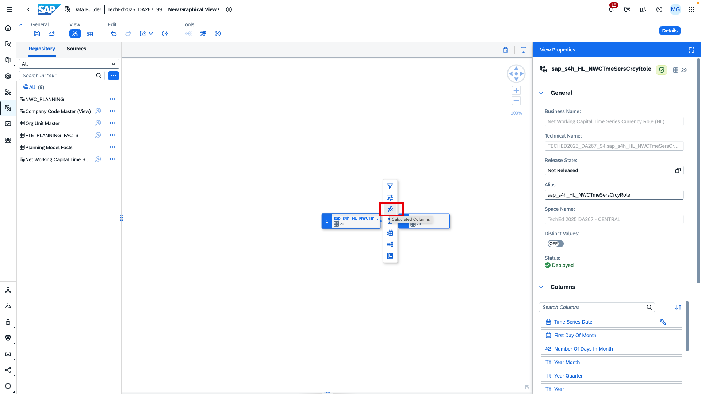
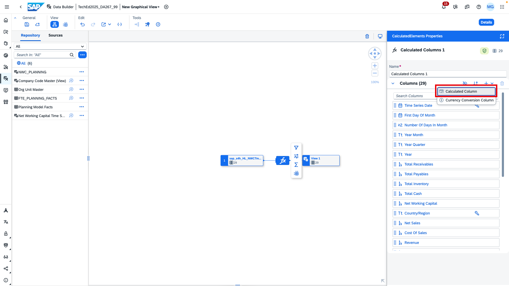
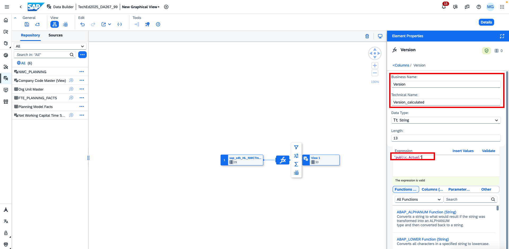

3. Pull the view `Planning Model Facts` which holds the data of the seamless planning model we created previously on to the calculation node. You will then be prompted whether to create a union or a join. Choose the union.
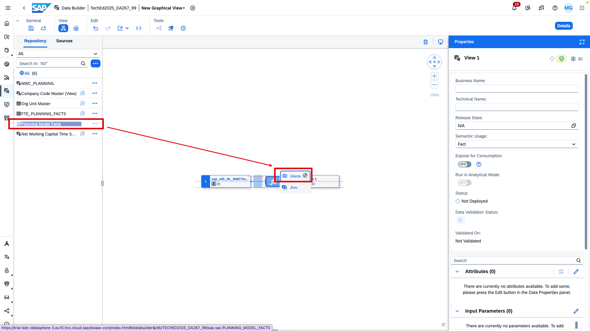

4. Create calculated column on the planning facts. It shall hold the fix currency information `USD`.
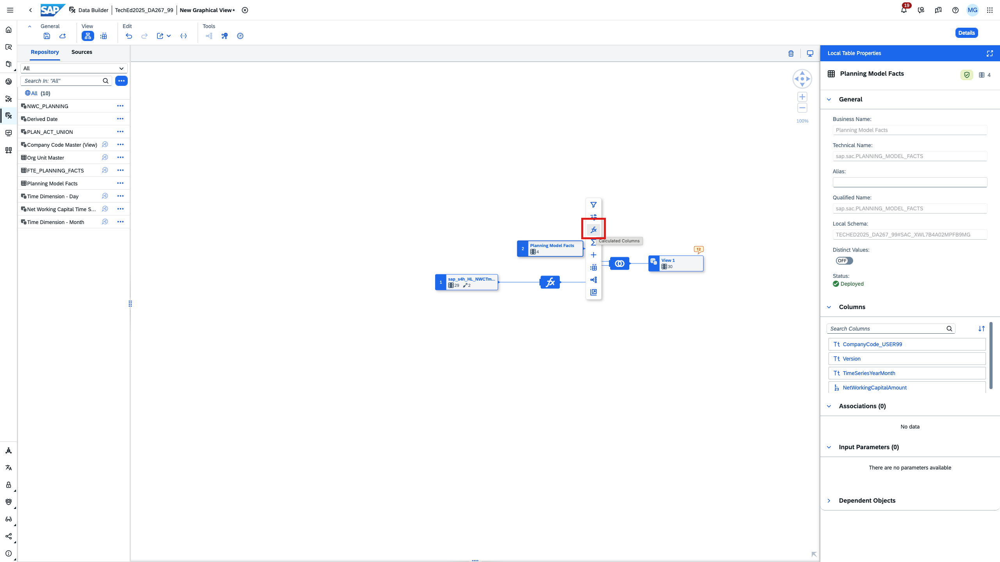
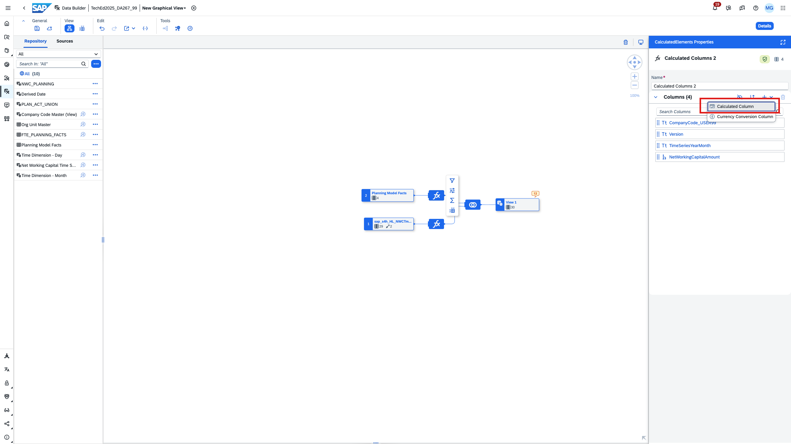
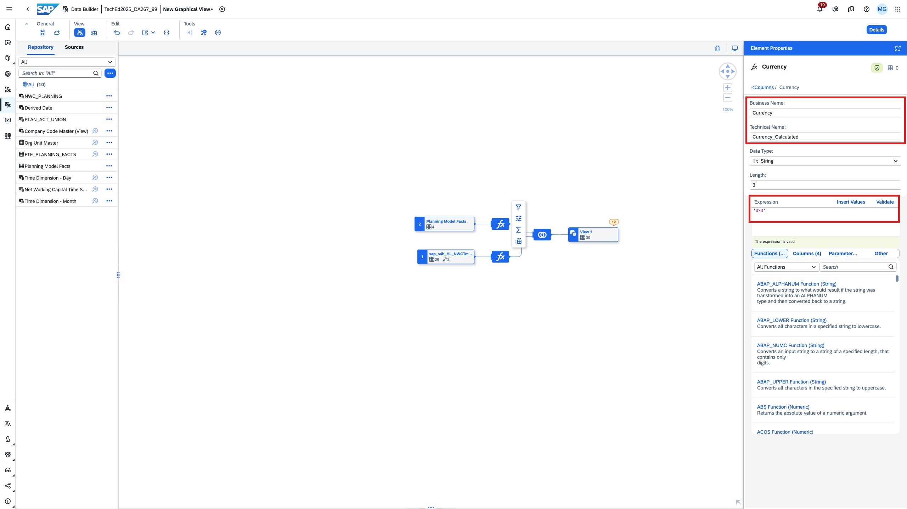

4. Map the `Currency`, `Version`, `Year Month` and `Company Code` columns by dragging and dropping the source columns on to the target columns as shown in the example below. The relations will be drawn accordingly.

5. Change the semantic type of the `Year Month` column to *Calendar - Year Month*. To do so, click on the three dots and go to *Semantic Type*.
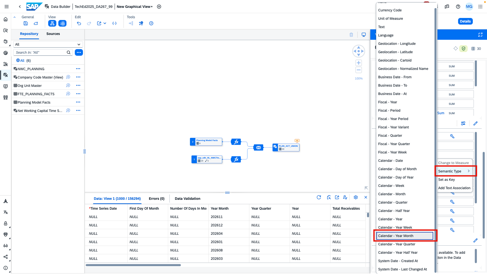

6. Add an association to the shared time dimension view `Time Dimension - Month`. Map the columns.
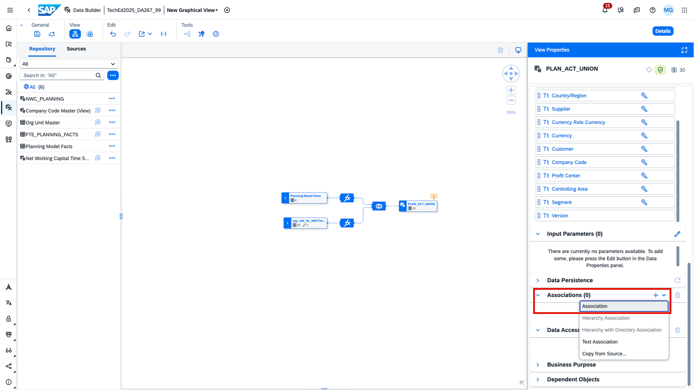
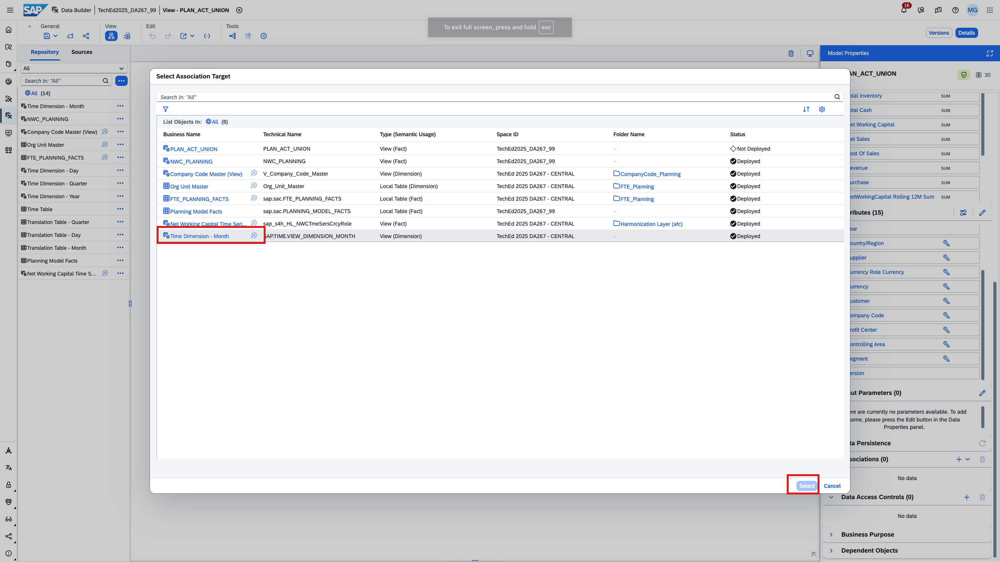
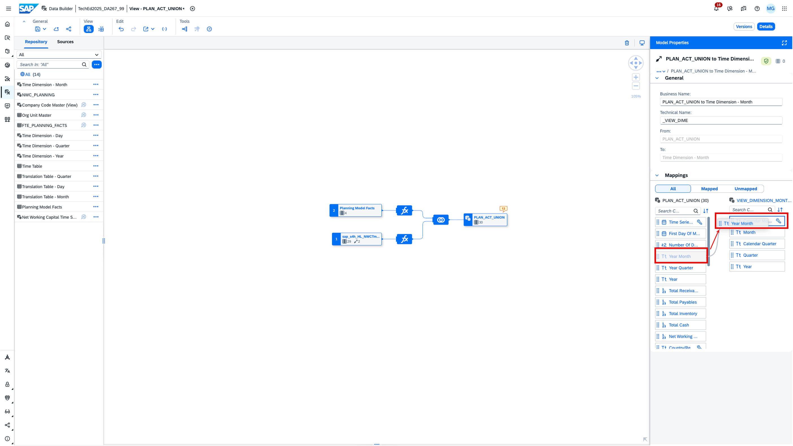

7. Add another association to the shared dimension view `Company Code Master (View)` and map the columns.
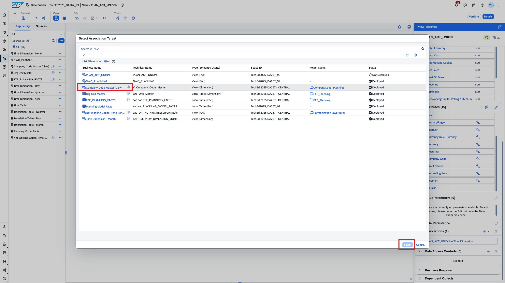
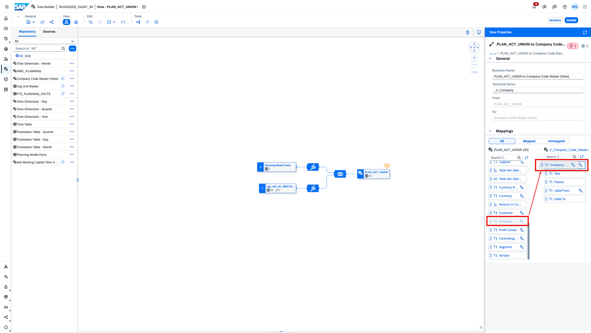

8. Provide a business name and a technical name for your view.
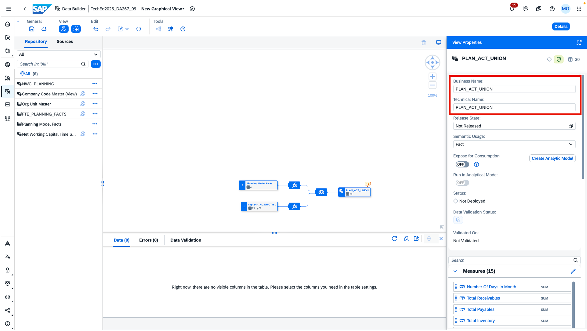

9. Deploy. 
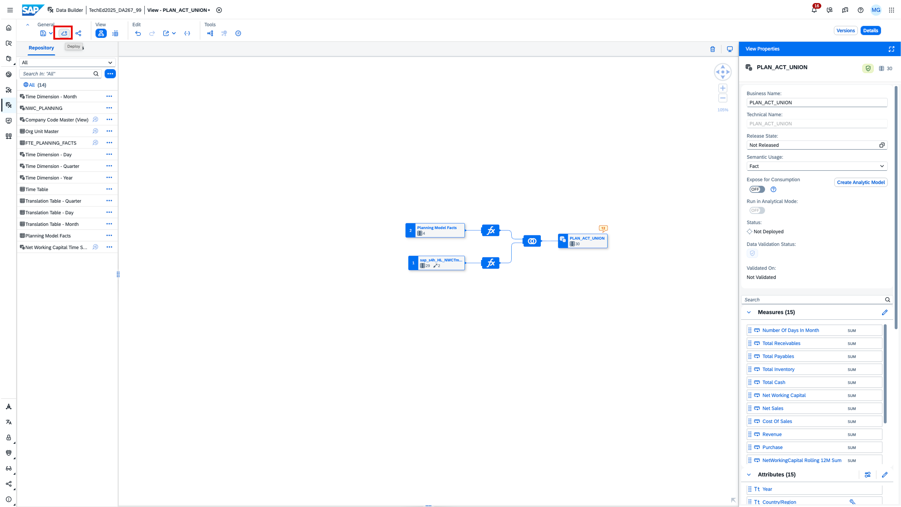

10. Wait until the view is deployed. Afterwards click *Create Analytic Model*.
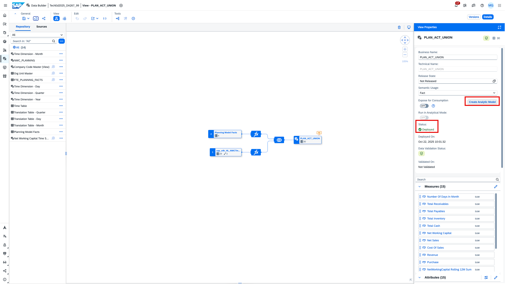

This concludes exercise 3.1. Now we move on to create an analytic model for plan vs. actual reporting as described in [exercise 3.2 - Create analytic model](../ex3.2_analytic_model/README.md).
