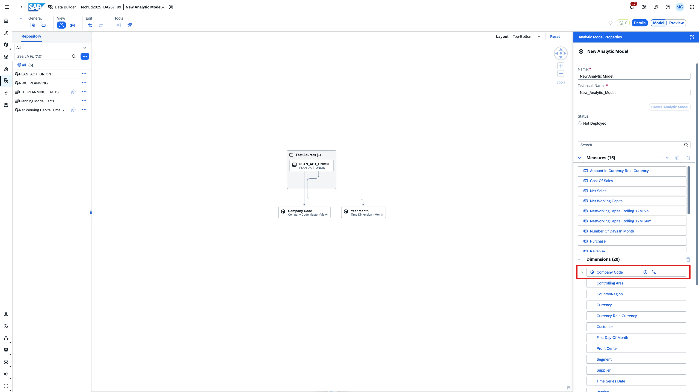
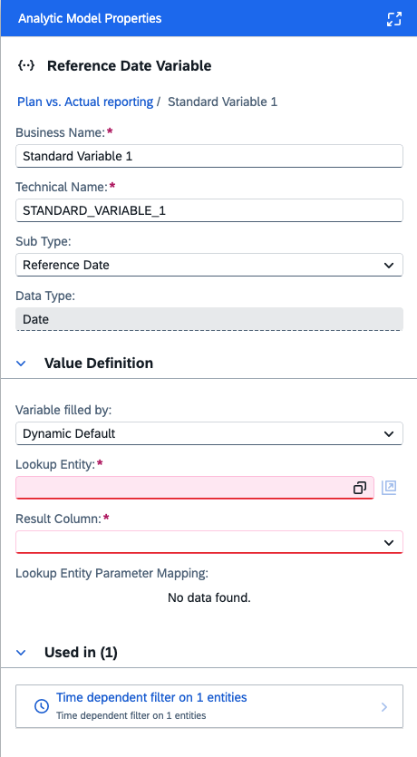
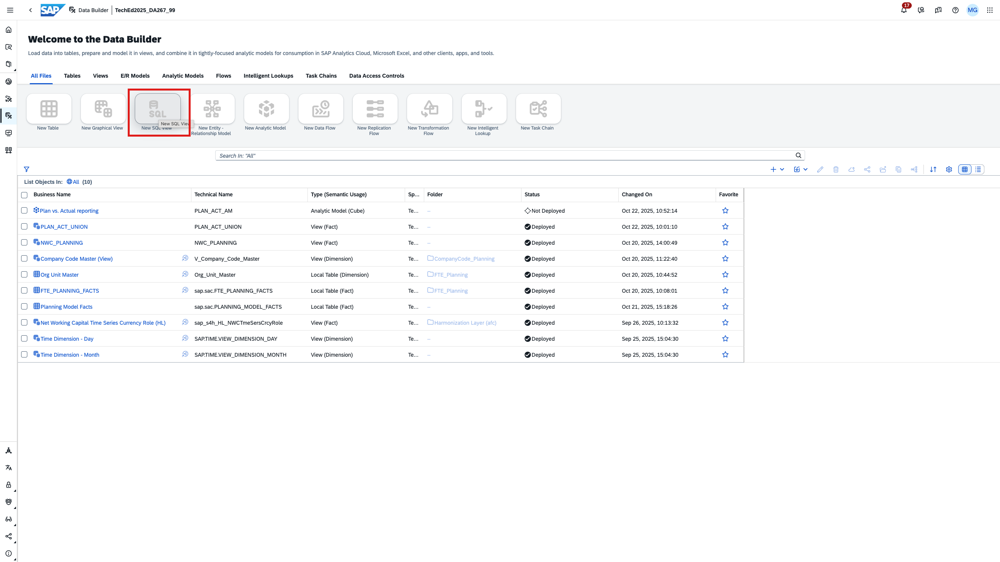
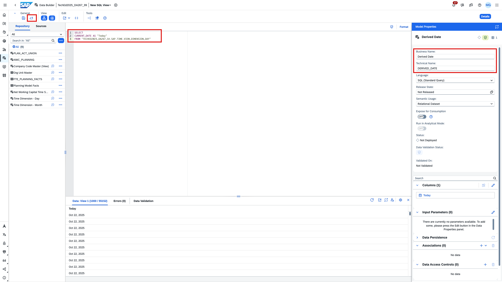
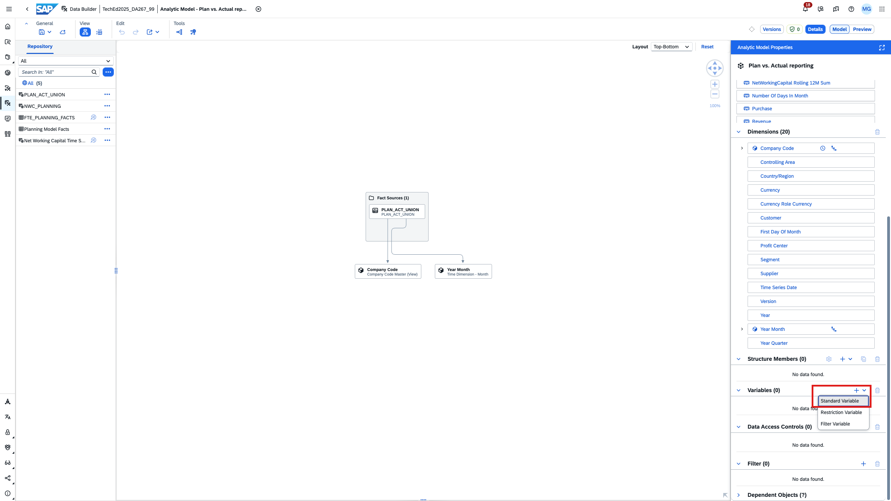
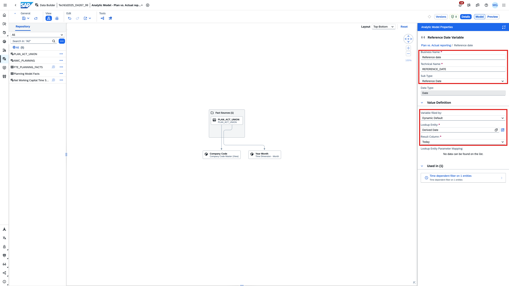
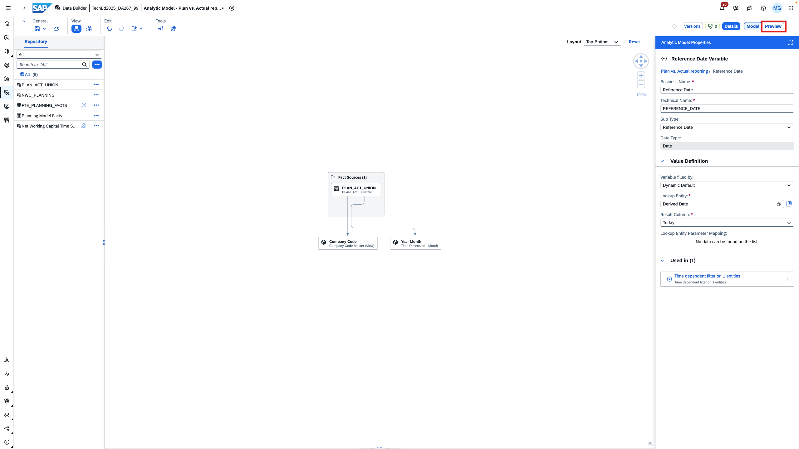
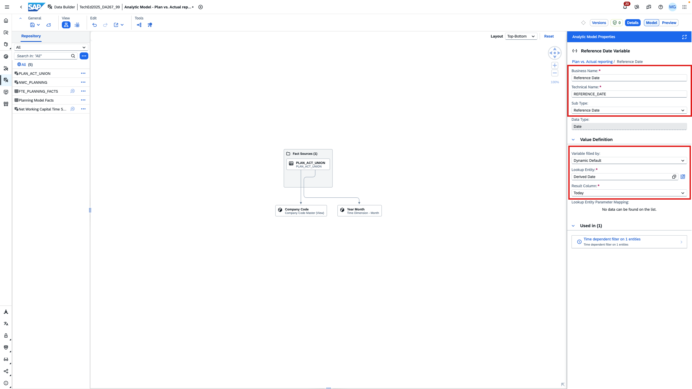
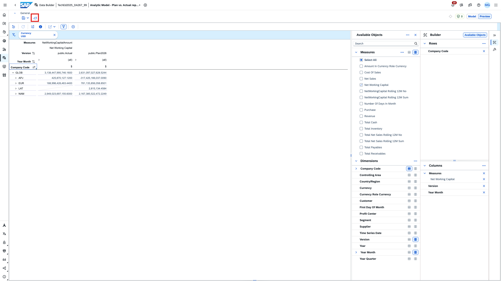

# Create an analytic model in SAP Datasphere
In this exercise, we use the view created in [exercise 3.1](../ex3.1_union) and build an analytic model and preview the data. 

> [!TIP]
> The Analytic Model is one of the cornerstones of SAP Datasphere. It allows multi-dimensional and semantically rich analytical modelling to answer business questions easier, faster and more efficiently. Want to learn more?
> - [Blogpost - Introducing the Analytic Model in SAP Datasphere](https://community.sap.com/t5/technology-blog-posts-by-sap/introducing-the-analytic-model-in-sap-datasphere/ba-p/13568591)
> - [Analytic Model Documentation in SAP Help Portal](https://help.sap.com/docs/SAP_DATASPHERE/c8a54ee704e94e15926551293243fd1d/e5fbe9e2cb93484dab8b1963145e565f.html)

1. In the first step, we review the analytic model. As you see, measure, dimensions and associations are taken over from the union that was created earlier. The company code dimension is time-dependent as indicated by the clock icon.

2. Provide a business name and a technical name and save the analytic model. Do not deploy it yet. We'll come back later.

3. We want to create a reference date variable to filter our time-dependent company code master data. The variable shall have a dynamic default value referring to today's date and should be adjustable for the reporting users. This is why we need to create a lookup entity in the next steps. 
  

> [!TIP]
> The Analytic Model offers three ways to fill variables:
> - Manual input
> - Derive Value: Derived variables are hidden in the data preview or in an SAP Analytics Cloud story. See Derived Variables.
> - Dynamic Default: You get a derived value in the parameter dialog list when opening the analytic preview, and in the variable prompt for an SAP Analytics Cloud story. See Dynamic Default.

4. Navigate to the data builder by clicking on the *back* arrow or the space name at the top left. Then create a new SQL view.

5. This SQL view shall deliver today's date as a result. Enter the following SQL and preview your data. Then name your view and deploy it. 

6. Go back to your analytic model. 

7. Add a variable of type *Standard Variable*.

8. Navigate to the data preview.

9. In the data preview, you can slice and dice the data as you wish. It re-uses the Data Analyzer of SAP Analytics Cloud.

> [!NOTE]
> We did not create a projection in our underyling union view to exclude columns. Hence, a lot of detail is offered for actuals which is not available for plan data as we only planned one measure by company codes. Also, we consciously did not implement currency conversion. More master data could be associated to our union view. We consciously did not add it to our space given the time constraints of our exercise.

> [!NOTE]
> Pay special attention to the usage of time dependent master data. Depending on the reference date, the right hierarchy is displayed. In 2026, the region *Europe* was split into *EMEA* and *MEE*. The user is prompted for the reference data when opening the preview (first screenshot). You can change the reference date as indicated in the second screenshot.

10. Deploy the analytic model.

The analytic model is created and lets us combine plan data with time dependent master data! On to [exercise 4](../../ex4_sac_story_reporting/README.md) where we will embedd this analytic model into our previously created story in SAP Analytics Cloud.
