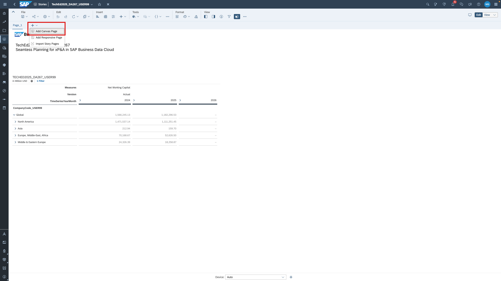
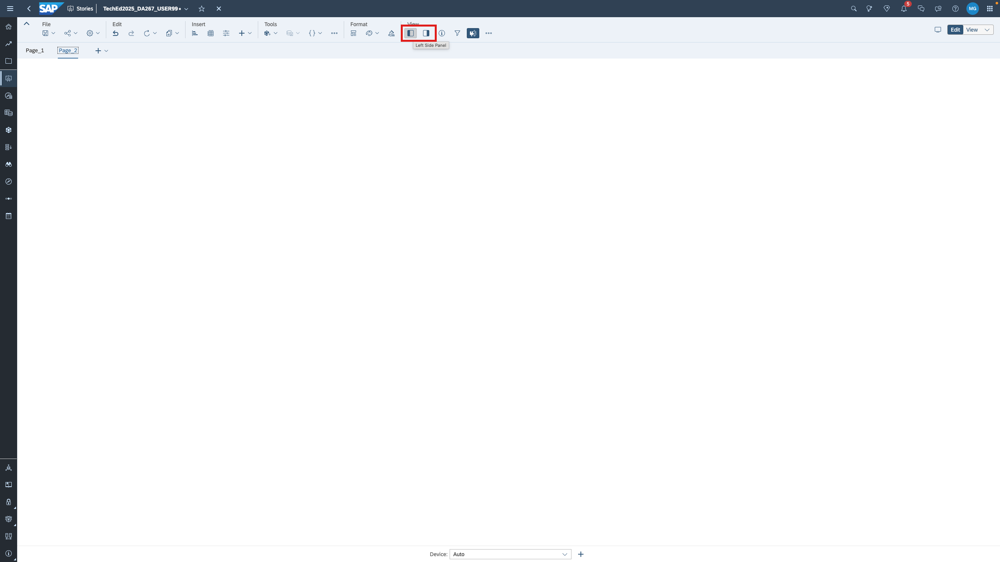
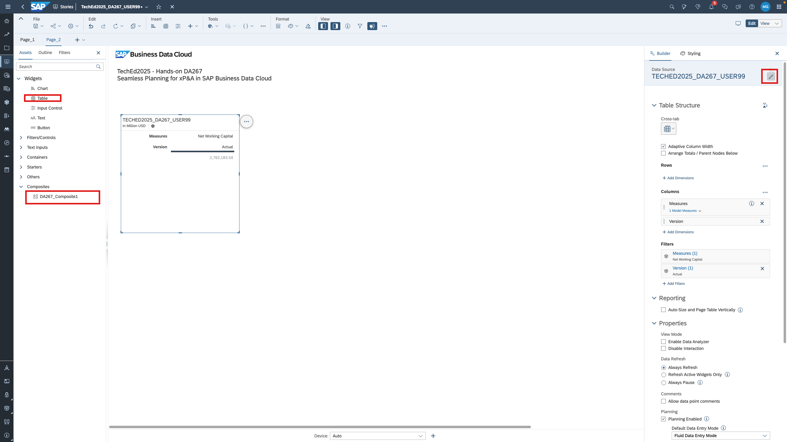
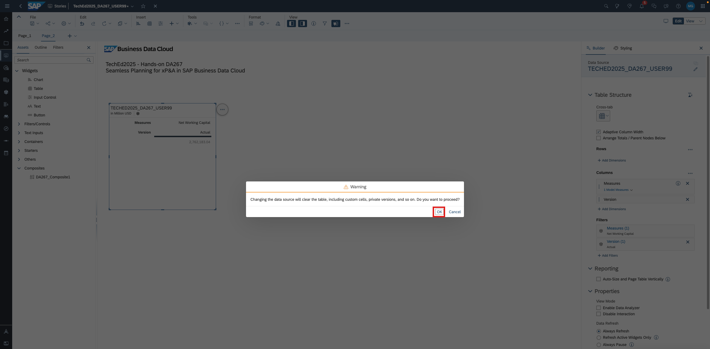
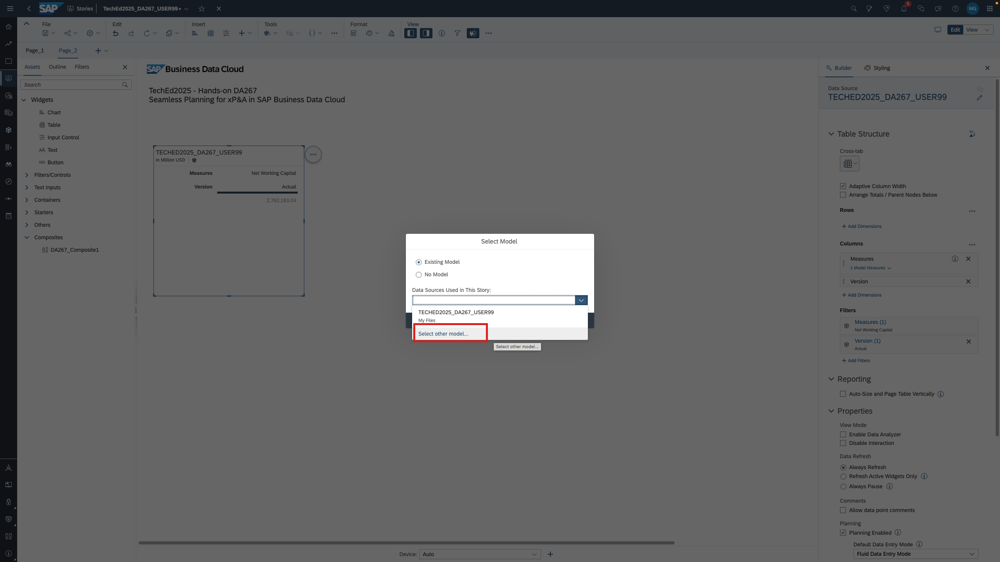
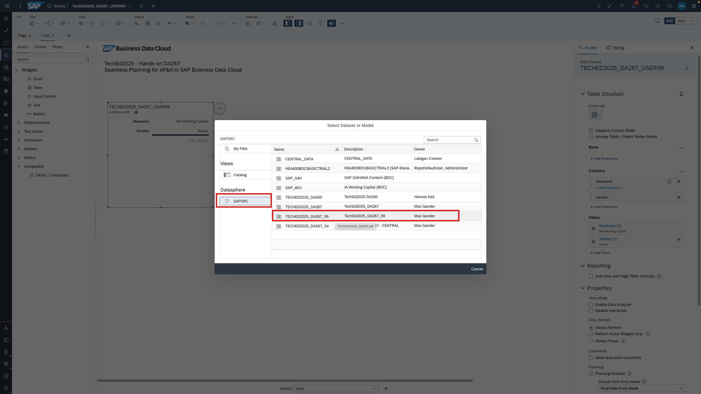
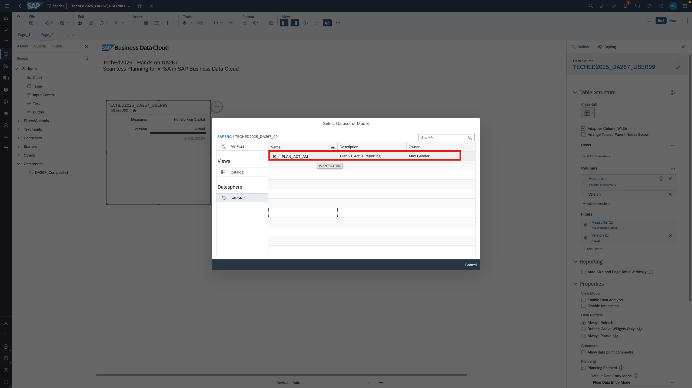
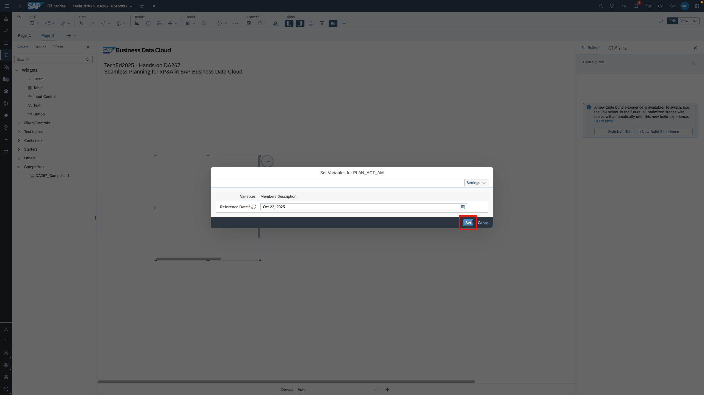
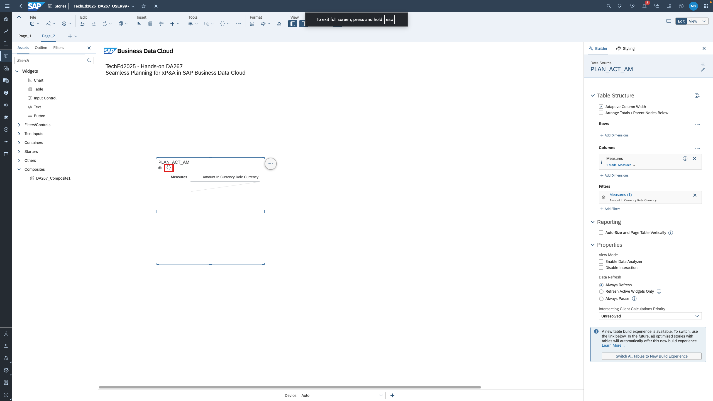
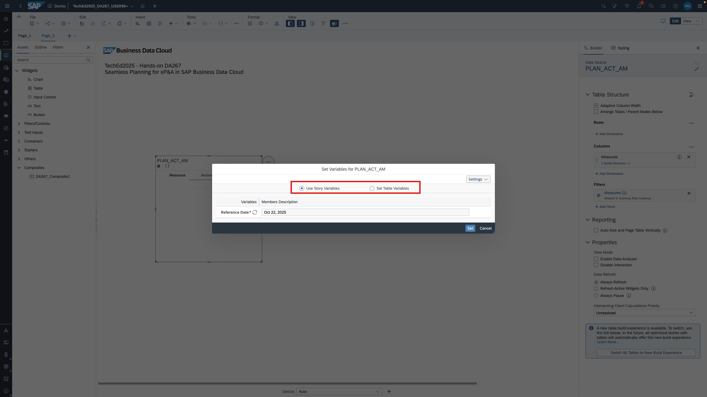

# Extend SAP Analytics Cloud Story with Reporting on the Analytic Model
Now that we created the analytic model in [exercise 3.2](../ex3_analytic_model/ex3.2_analytic_model), we want to embedd it into our SAP Analytics Cloud story as well. 

1. Go back to  [SAP Analytics Cloud](https://trial-bdc-sac-3.eu10.sapanalytics.cloud/sap/fpa/ui/app.html#/home) and navigate to the story you created earlier. You can either go via the *Files/My Files* or *Stories/Recent Files*.

2. Add a canvas page.

3. Display the left and the right side panel.

4. Drag the header composite to the canvas as you already did already in [exercise 2](../ex2_story/README.md). Add a table as well and then change the datasource of the table.

5. Confirm the next dialogue and click *Select other model...*.

6. Select the SAP Datasphere tenant *SAPSRC* on the left hand side. Then select your space. 

7. Select your analytic model.

8. Set the reference date variable value. You can change the variable value from the table afterwards and decide whether you want to apply a story-wide or table-specific setting. 

10. Now, you can create a drill-down as shown in the video below.

> [!NOTE]  
> The point of this exercise is to show you how to add an analytic model to a story. The exact drill-down that you create is not important. If you have the feeling that remaining time is an issue, you can end this exercise at this point. If you feel you have plenty of time, you can also create some charts. 

> [!NOTE]  
> You may notice the version column is not recognized as a version by SAP Analytics Cloud. We plan to work on that in 2026 so aggregation across versions is forbidden and report styling rules can be applied.

We closed the loop! We created a planning model based on Actual data, planned data, built a joint plan vs. actual reporting using advanced modeling capabilities of SAP Datasphere and finally, we have built a reporting story on top. In the remaining exercises, we want to extend our planning model with HR and salary data. Move on to [exercise 5](../ex5_FTE_plan_data/ex5.1_enhance_model_structure/README.md) to get started. 
