# Enhance the planning model structure for cost planning
In this exercise, we will add measures and dimensions to make the planning model ready for cost planning. We focus on the planning of salaries and we will again leverage live versions - this time to reference HR plan data. 

1. Go back to  [SAP Analytics Cloud](https://trial-bdc-sac-3.eu10.sapanalytics.cloud/sap/fpa/ui/app.html#/home) and navigate to your planning model. You can either go via the *Files/My Files* or *Modeler/Recent Files*.

2. Create a new measure. Make/change the following details and settings
- Name: FTE
- Exception Aggregation: LAST
- Exception Aggregation Dimemsions: TimeSeriesYearMonth
- Unit Type: Unit
- Unit: Fixed - FTE
- Scale: None
- Decimal Places: 2

> [!NOTE]  
> From now on, you will see a validation error in your model as we'll need to adjust the mapping for the existing live version. Don't worry, we'll take care. 

3. Create another measure:
- Name: AMOUNT
- Unit Type: Currency
- Currency: Fixed - USD
- Scale: None
- Decimal Places: 2

4. Create a generic dimension for accounts. It does not have to be public. 
> [!NOTE]  
> It is not possible to add a dimension of type *Account* to a plannig model which already is in use. Since we anyways do not want to use account dimension specific functionality as formulas or account types, we can use a generic dimension. There is no limitation to use account dimensions in seamless planning. 

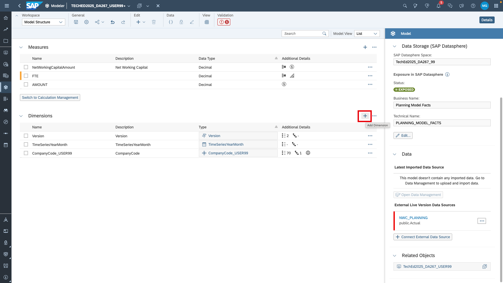
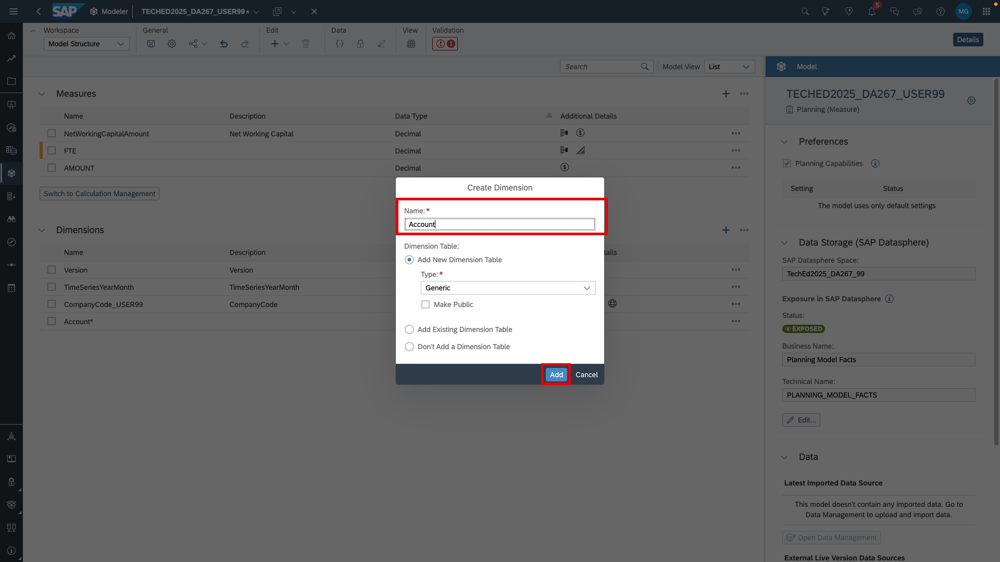

5. Open the dimension.
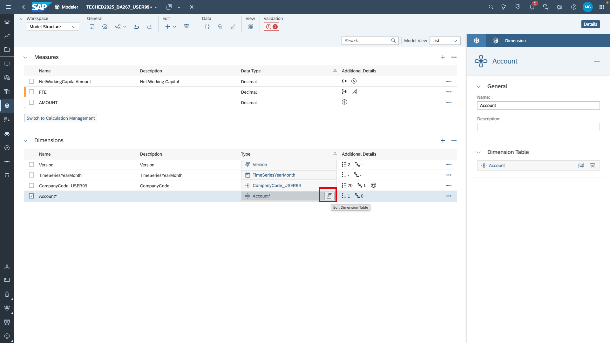

6. Create a parent-child hierarchy and give it a name.
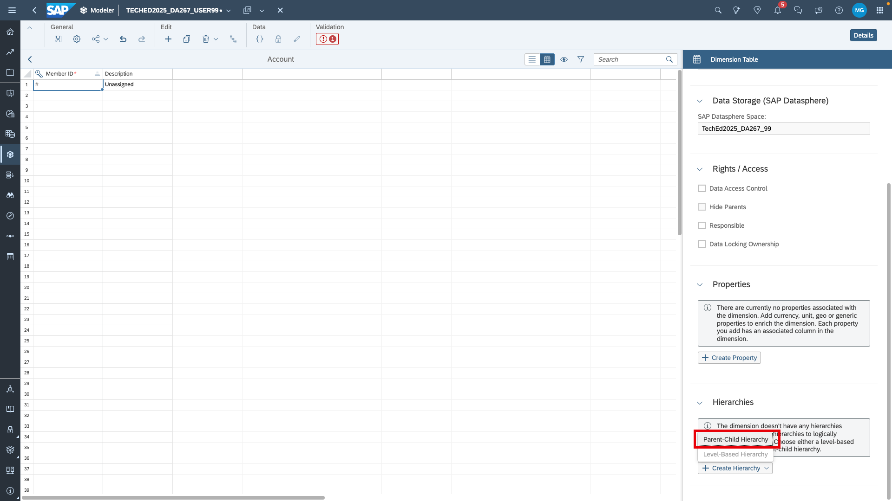
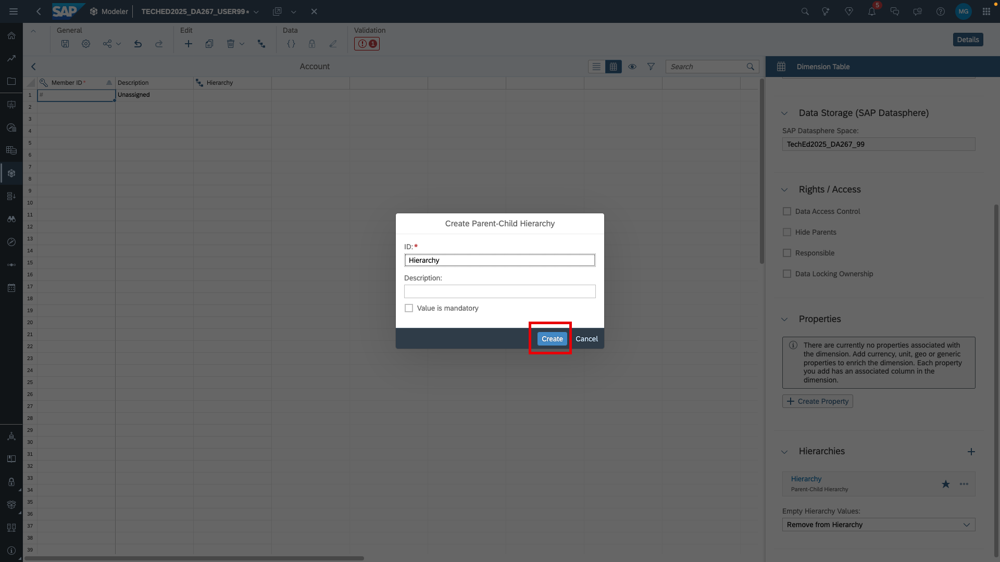 
  
7. Open . You can download the file via the download button or *View raw*. Paste the entries into the dimension table.

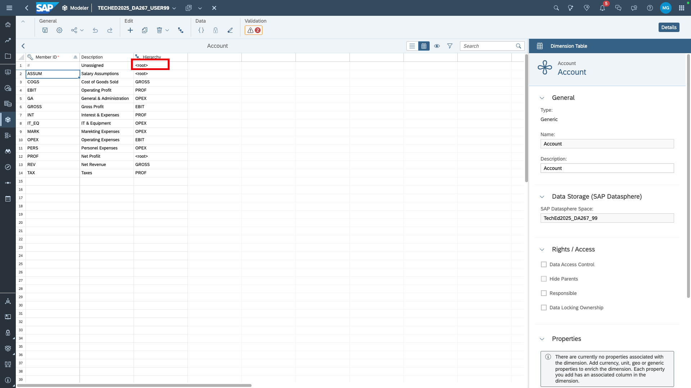

9. Go back to the model structure and resolve mapping issues. You can either jump into the error from the validation message or open the column mapping of the live version.
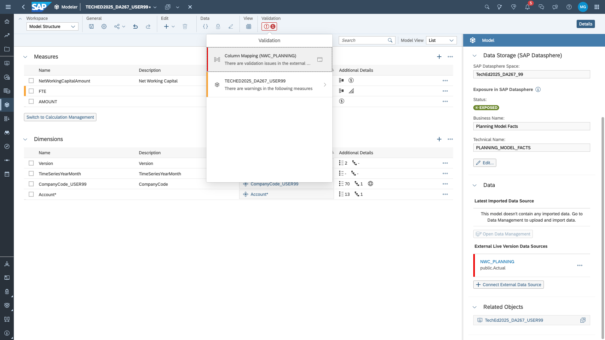
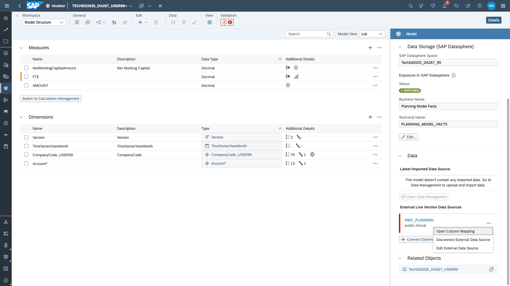

10. The existing live version for Net Working Capital does not contain columns for the new FTE or AMOUNT measures of the model. We can set them to a default value via the marked buttons and leave *NULL* as default value. We do not have an account either, so we map it to the default value *Unassigned*.
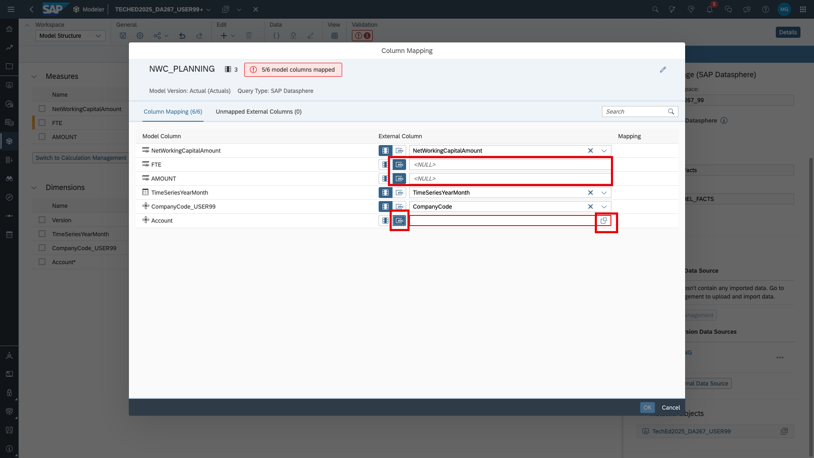
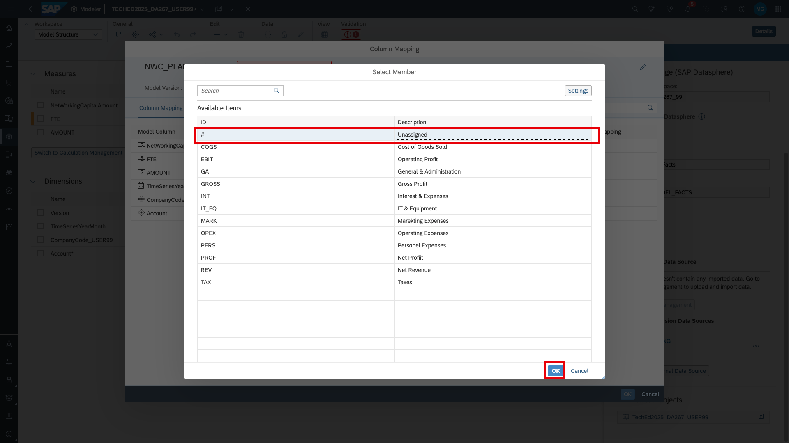

11. Save the model. You will be prompted to specify a default account. Choose *Unassigned*.
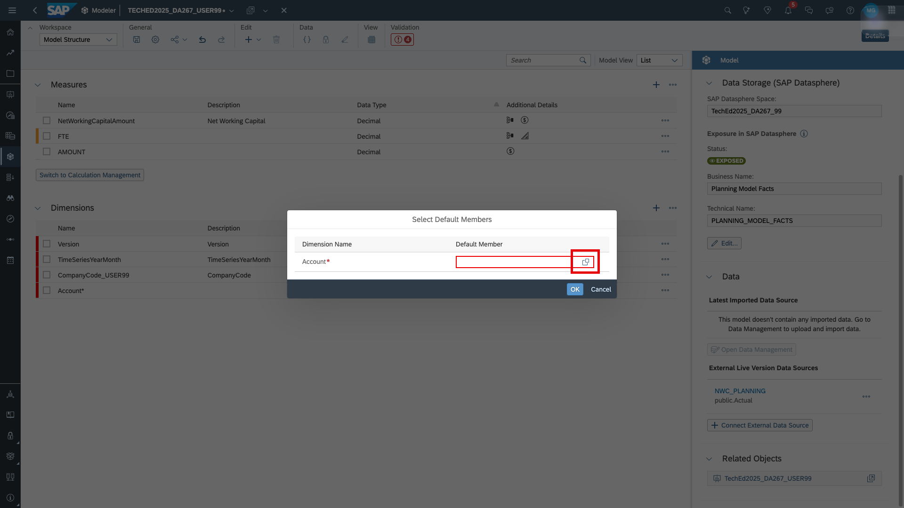
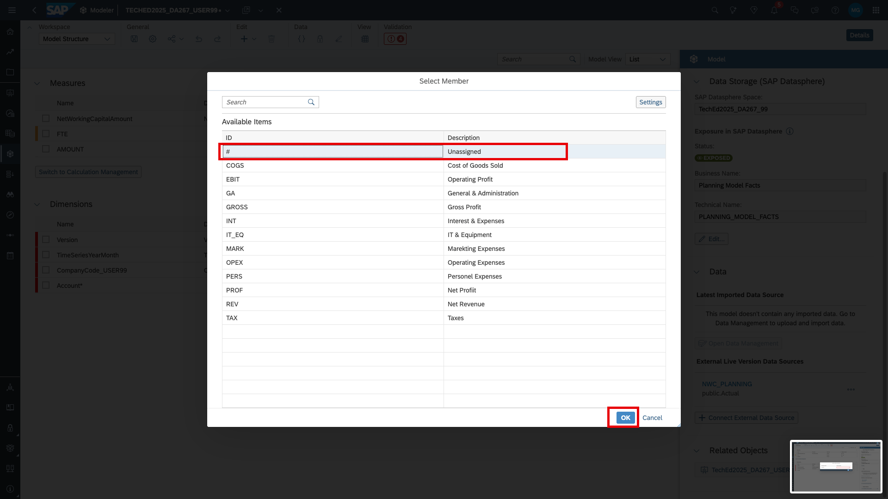

Go on to [exercise 5.2](../ex5.2_add_FTE_data/README.md). The model is ready to connect to FTE data. 
