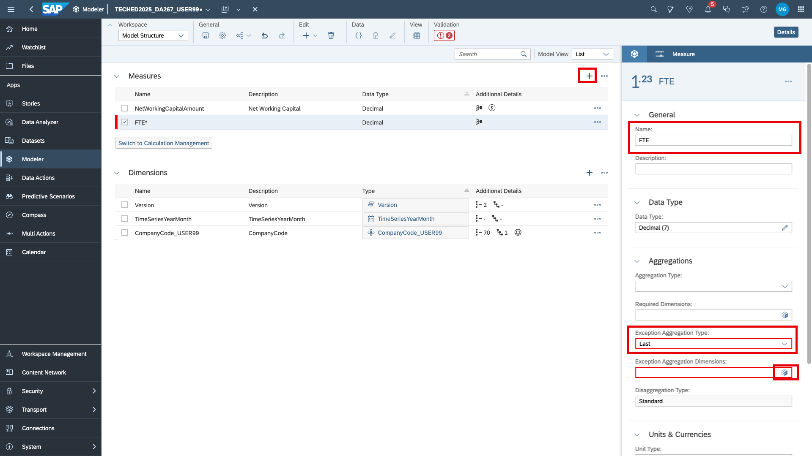
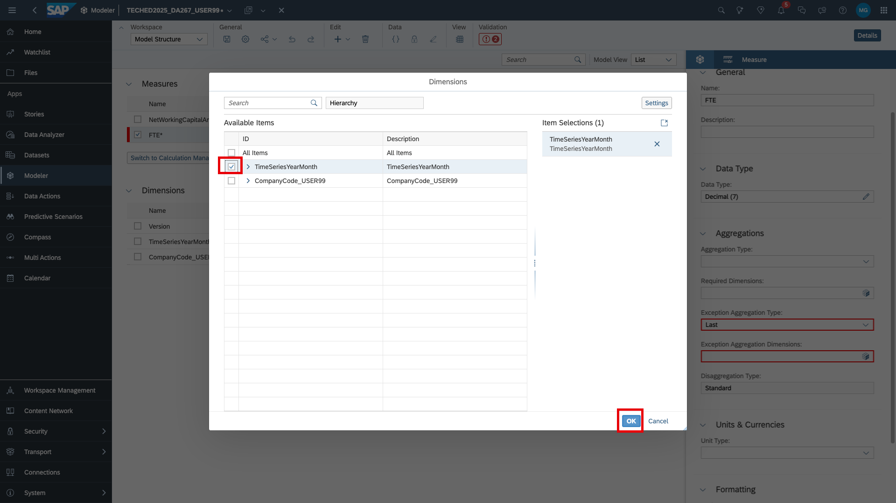
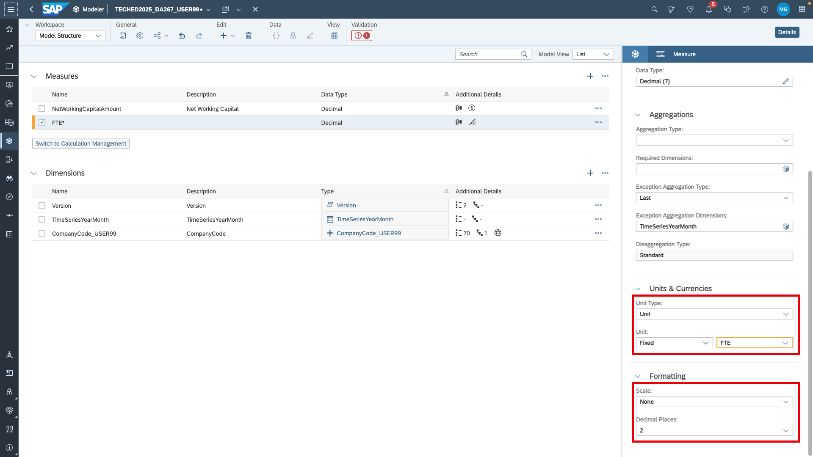
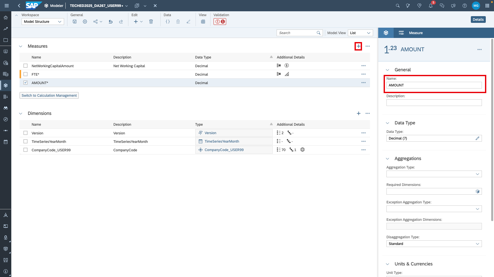
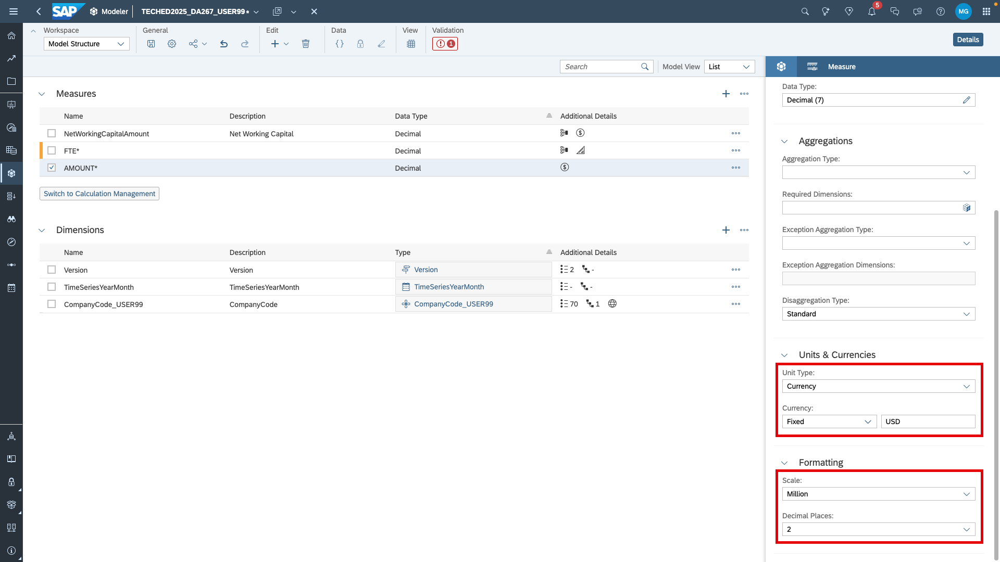

# Enhance the planning model structure for cost planning
In this exercise, we will add measures and dimensions to make the planning model ready for cost planning. We focus on the planning of salaries and we will again leverage live versions - this time to reference HR plan data. 

1. Go back to  [SAP Analytics Cloud](https://trial-bdc-sac-3.eu10.sapanalytics.cloud/sap/fpa/ui/app.html#/home) and navigate to your planning model. You can either go via the *Files/My Files* or *Modeler/Recent Files*.

2. Create a new measure. Make/change the following details and settings
- Name: FTE
- Exception Aggregation: LAST
- Exception Aggregation Dimemsions: TimeSeriesYearMonth
- Unit Type: Unit
- Unit: Fixed - FTE
- Scale: None
- Decimal Places: 2

3. Create another measure:
- Name: AMOUNT
- Unit Type: Currency
- Currency: Fixed - USD
- Scale: None
- Decimal Places: 2

