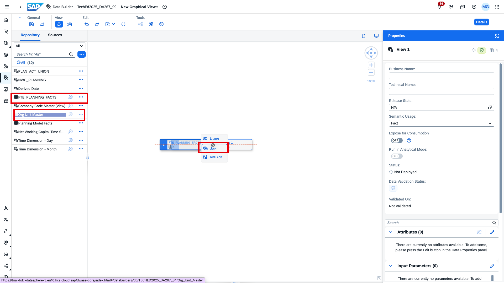
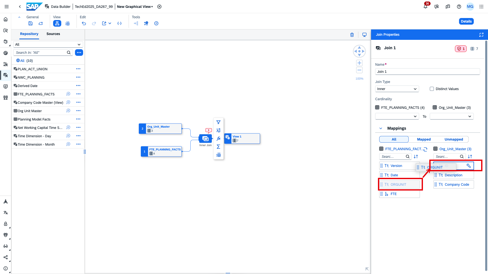
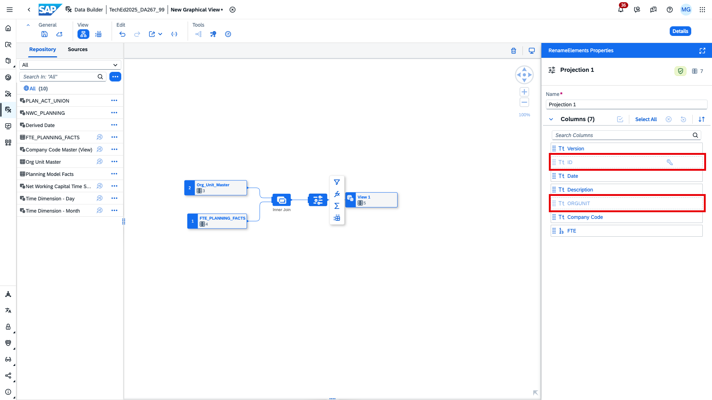
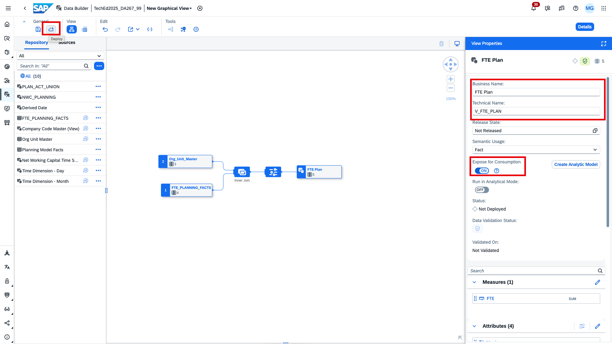
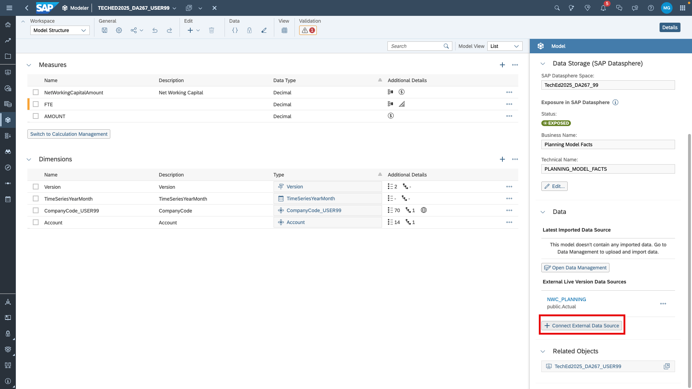
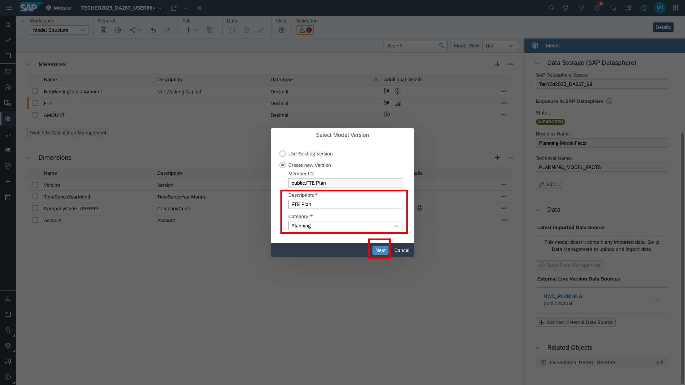
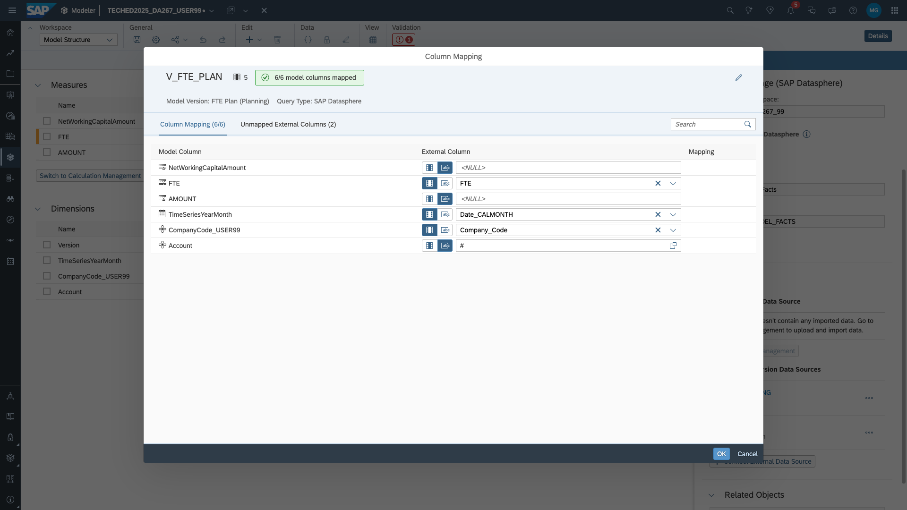

# Add a live version for FTE data to the planning model
We now want to add data from an HR planning model with FTE (full-time equivalent) data to our planning model. HR planning does not happen on the same dimensionality so we have to map/add information.

1. Go back to [SAP Datasphere](https://trial-bdc-datasphere-3.eu10.hcs.cloud.sap/dwaas-core/index.html), go to the data builder, select your space and create a new graphical view.

2. In the graphical view, add the shared table `FTE_PLANNING_FACTS`. This is the exposed fact table of the HR planning model.

3. Pull the shared table `Org Unit Master` on `FTE_PLANNING_FACTS` and create a join.

4. In the join definition, map `ORGUNIT` to `ID`. As you can see, the Org Unit master data has a company code attribute. We need this in our planning model. 

5. Add a projection and exclude the `ID` and the `ORGUNIT` columns. We only need the company code information going forward.

6. Name the view, expose it for consumption and deploy it.

7. Go back to  [SAP Analytics Cloud](https://trial-bdc-sac-3.eu10.sapanalytics.cloud/sap/fpa/ui/app.html#/home) and navigate to your planning model. You can either go via the *Files/My Files* or *Modeler/Recent Files*.

8. To add a live version to an existing model, click *Connect External Data Source*

9. One live version is mapped to one version. Create a new version and call it `FTE Plan`. 

10. Select the newly created view.

11. Map columns as follows and click *Ok*:

12. Save your model.

You can now go ahead and calculate personnel expenses in [exercise 6](../../ex6_pex_calc/ex6.1_data_action)
