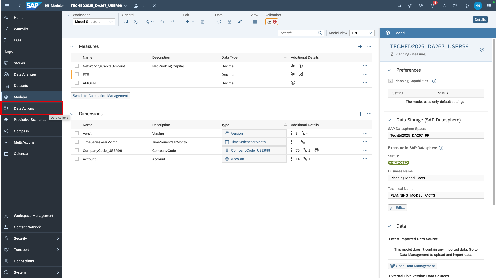
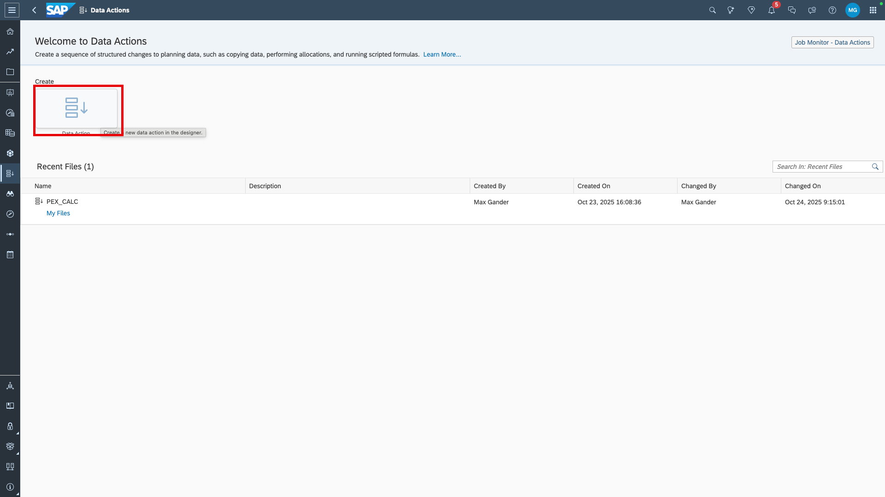
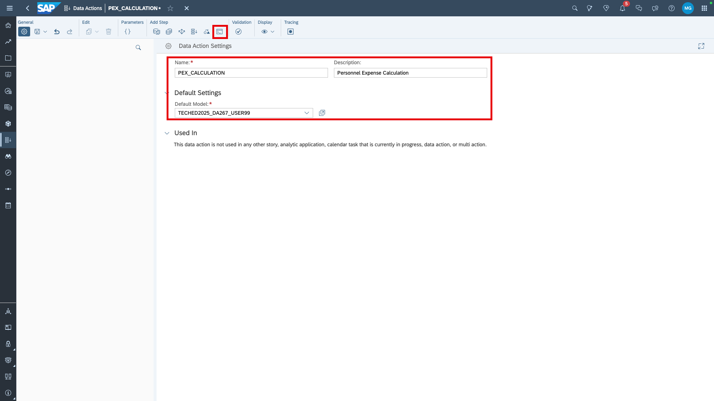
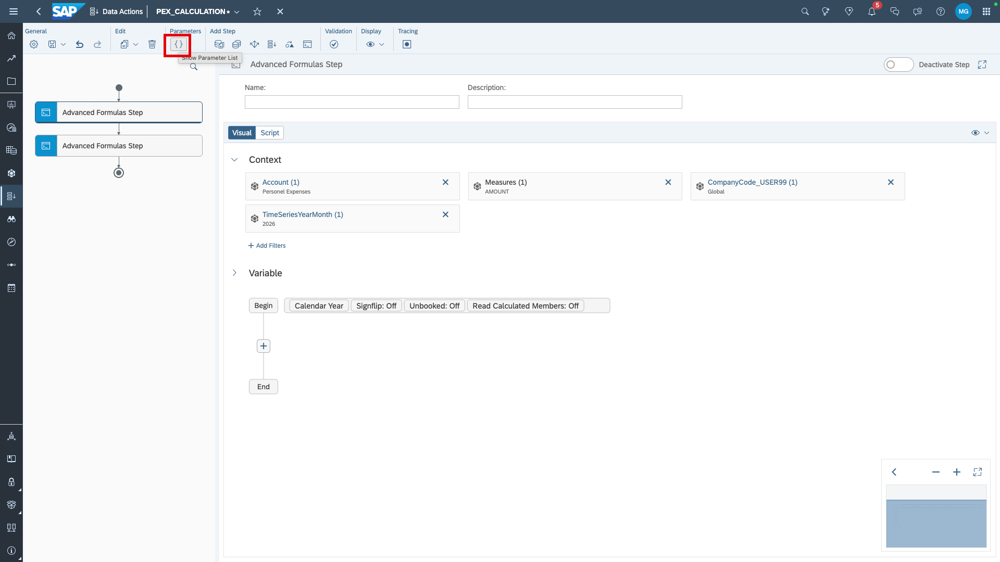
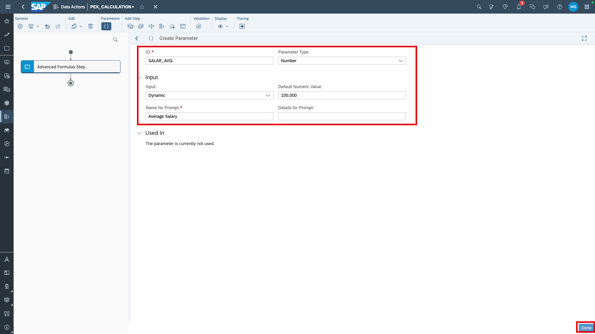
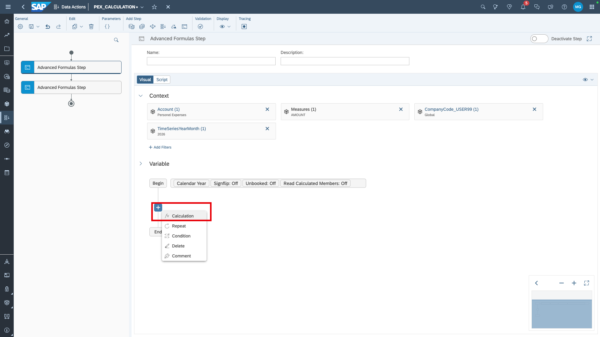
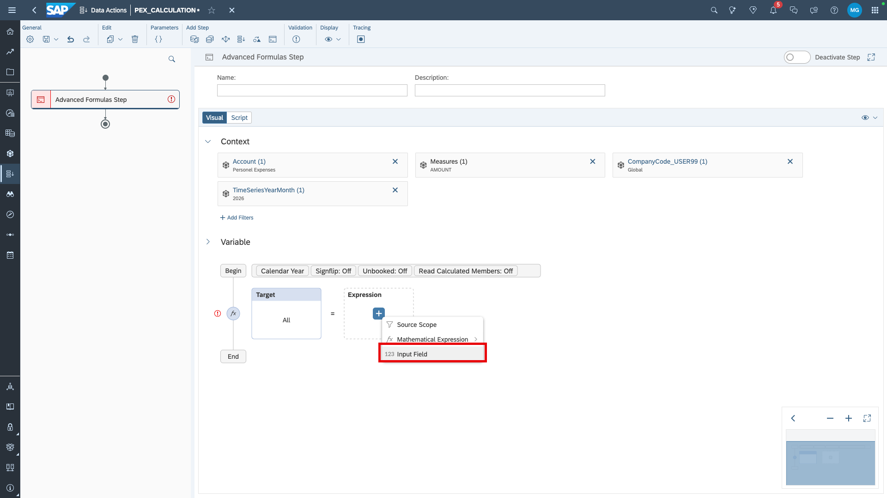
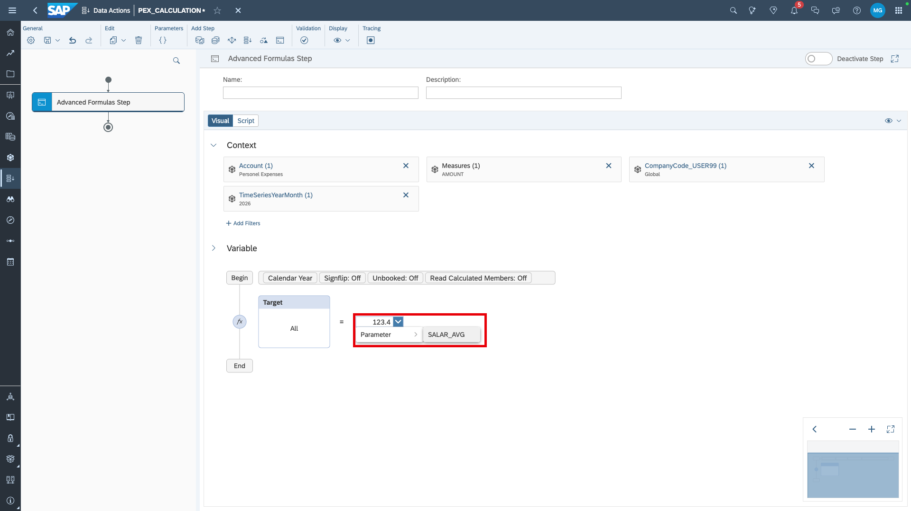
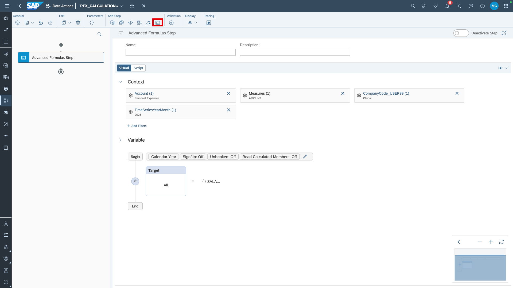
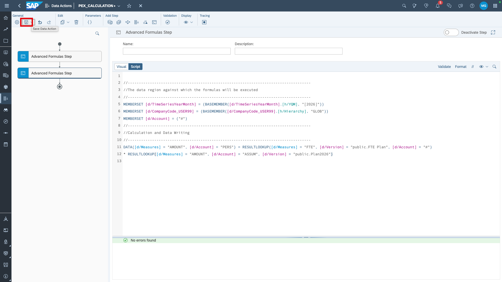

# Calculation of personnel expenses
Now, we want to calculate personnel expenses. We pretend that this is only base salary. Let's first understand how we want to calculate them.
We will use the following measures/accounts:
- FTE measure (`FTE`) --> number of employees in full-time equivalents
- Salary Assumptions account (`ASSUM`) --> to hold the assumed average salary per 1 FTE
- Personnel Expenses account (`PERS`) --> to hold the calculated salary value (FTE * Salary Assumptions)

We will use a data action to calculate the salaries. It shall first populate the average salaries based on a user parameter and then multiply the FTE by the maintained assumption.

1. Navigate to *Data Actions*


2. Create a new data action.


3. Name your data action and select your planning model as default model. Then, add an advanced formulas step. 


> [!NOTE]  
> Optionally, name your steps. This is especially useful when data actions have many steps. 

4. We can easily use the visual formula editor for the first step which is to fill the salary assumption account. First, set filters as below. Then add a parameter. 


5. Create parameter.


6. Name your parameter and and make it of type *Number*. The parameter should be dynamic so users can adjust it as they like. Set the default to 100,000. 


7. Go back to your advanced formula step and add a calculation. 


8. The expression shall be an input field.


9. Select the previously selected parameter instead of a manual input via the drop-down. Then, add another advanced formula step. 



10. This time, we use the script formula generator. Switch to *Script*. 


11. Enter the following script:
> [!CAUTION]  
> You need to adjust the script based on the name of your company code dimension. If any other names differ in your model (e.g., version names), pay attention to that as well. 

```
//-----------------------------------------------------------------------------------
//The data region against which the formulas will be executed.
//-----------------------------------------------------------------------------------
MEMBERSET [d/TimeSeriesYearMonth] = (BASEMEMBER([d/TimeSeriesYearMonth].[h/YQM], "[2026]"))
MEMBERSET [d/CompanyCode_USER99] = (BASEMEMBER([d/CompanyCode_USER99].[h/Hierarchy], "GLOB"))
MEMBERSET [d/Account] = ("#")
//-----------------------------------------------------------------------------------
//Calculation and Data Writing
//-----------------------------------------------------------------------------------
DATA([d/Measures] = "AMOUNT", [d/Account] = "PERS") = RESULTLOOKUP([d/Measures] = "FTE", [d/Version] = "public.FTE Plan", [d/Account] = "#") * RESULTLOOKUP([d/Measures] = "AMOUNT", [d/Account] = "ASSUM", [d/Version] = "public.Plan2026")
```



12. Validate the script. Then save.

In [exercise 6.2](../ex6.2_pex_execution), we will run this data action in a story and review the results.
