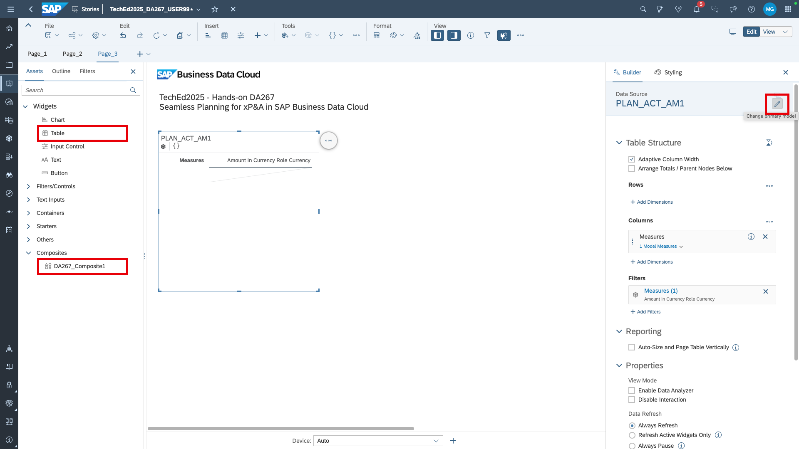
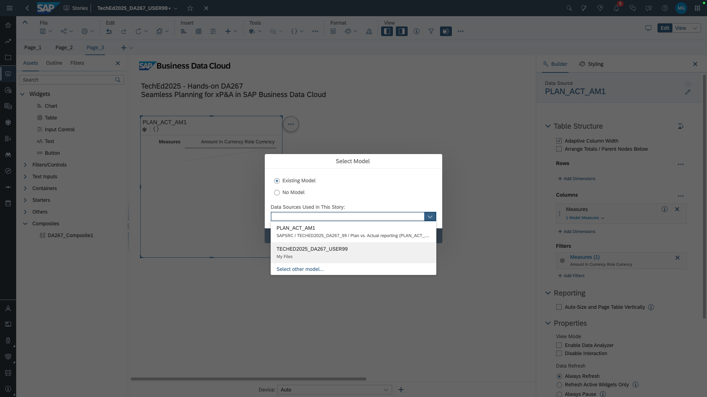
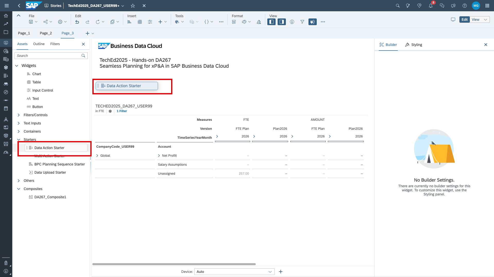
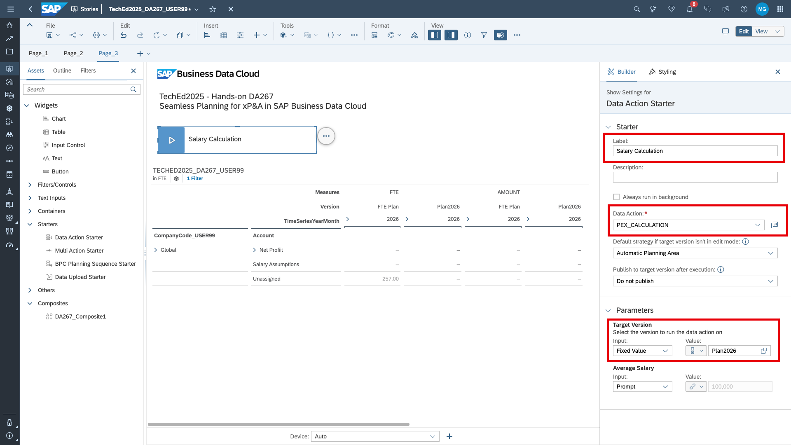
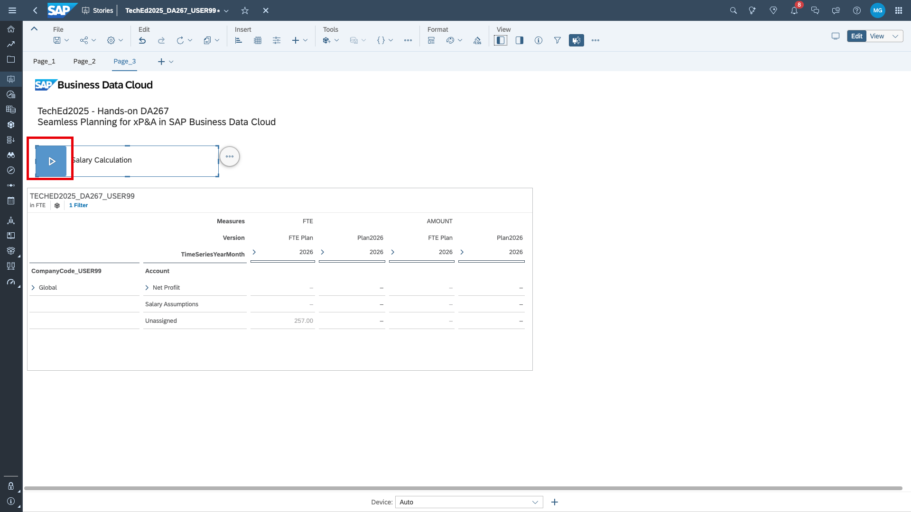

# Execute the salary calculation in a story
In this exercise, we will build a table to check the values that our data action is about to calculate. We'll trigger the calculation from the same story. This is the final exercise!

1. Open your story. You can either go via the *Files/My Files* or *Stories/Recent Files*.

2. Display the left and the right side panel. Pull the composite and a table on to the canvas. Change the data source of the table.

3. Select your planning model.

4. Build your table as per the video.

Rows:
- `Company Code`
- `Account`

Columns:
- Measures: `FTE`, `AMOUNT`
- Versions: `FTE_PLAN`, `Plan2026`
- Date: `2026` 

5. Pull a data actions starter to the canvas.

6. Set up the data action starter with a name and the data action you just created. The target version can be fixed to Plan2026. The salary assumption shall be prompted so that users can adjust it.

7. Run the data action.

> [!NOTE]  
> Remember that the transactional data can differ from the screenshots.

Done! You completed the entire exercise. Congratulations!
